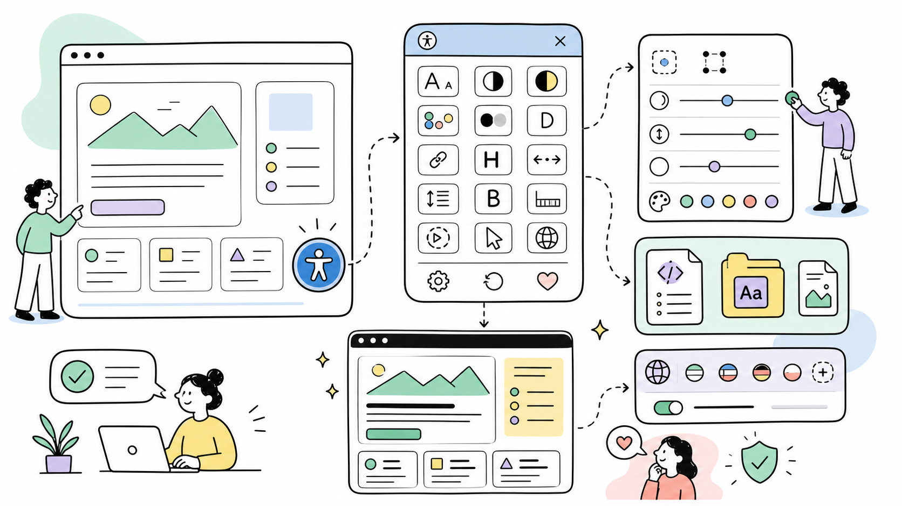

# Ally (a11y) — Accessibility Widget for ProcessWire

Ally adds a self-hosted accessibility widget to your ProcessWire site. Powered by [Sienna](https://github.com/bennyluk/Sienna-Accessibility-Widget) (MIT), the JS bundle ships with the module and is served from your own server — no external CDN, no third-party requests at runtime. The OpenDyslexic font used by the dyslexia-friendly mode is also bundled locally (`vendor/fonts/`), so even that feature makes no off-site requests.

**Author:** Maxim Semenov  
**Website:** [smnv.org](https://smnv.org)  
**Email:** [maxim@smnv.org](mailto:maxim@smnv.org)

If this project helps your work, consider supporting future development: [GitHub Sponsors](https://github.com/sponsors/mxmsmnv) or [smnv.org/sponsor](https://smnv.org/sponsor/).  

## Features

- Font size adjustment
- Dark, light, and high contrast modes
- High / low saturation, monochrome
- Dyslexia-friendly font
- Highlight links and headings
- Letter spacing, line height, bold text
- Reading guide, stop animations, big cursor
- 53 languages with auto-detection from `html[lang]` or browser settings
- Full ProcessWire multi-language support — maps `$user->language` to the correct locale automatically
- Configurable position, offset, button size, and accent color
- Skips admin pages and Chrome Lighthouse by default

## Installation

1. Download or clone this repository into `site/modules/Ally/`
2. Go to **Modules → Refresh** in the ProcessWire admin
3. Install **Ally (a11y)**
4. Configure via **Modules → Ally**

The module ships with a prebuilt JS bundle at `vendor/sienna-accessibility.umd.js`. No build step required.

## Configuration

All settings are available in the module config UI:

| Setting | Default | Description |
|---|---|---|
| Enabled | Yes | Toggle widget on/off without uninstalling |
| Position | Bottom Left | 8 positions available |
| Offset X / Y | 20px | Distance from the edge |
| Button Size | 58px | Widget button diameter |
| Accent Color | Sienna default | Optional custom color for the widget button (background + outline) |
| Language | Auto | Auto-detect or force a specific locale |
| Skip Admin Pages | Yes | Do not inject on admin template |
| Skip Lighthouse | Yes | Do not inject when Chrome-Lighthouse UA is detected |

## Requirements

- ProcessWire 3.0.200+
- PHP 8.1+

## Notes

- The widget is injected by hooking `Page::render`. If you serve pages through **ProCache** (static HTML files bypassing PHP), the hook does not run and the widget is not injected on cached pages — exclude those pages from ProCache or disable caching for them if you need the widget there.
- Overlay accessibility widgets supplement, but do not replace, building accessible markup. Use Ally alongside good semantic HTML, not instead of it.

## License

MIT — see [LICENSE](LICENSE)

Bundled third-party components:

- Sienna Accessibility Widget by [Benny Luk](https://github.com/bennyluk/Sienna-Accessibility-Widget) — MIT.
- [OpenDyslexic](https://opendyslexic.org/) font by Abelardo Gonzalez — SIL Open Font License 1.1.
